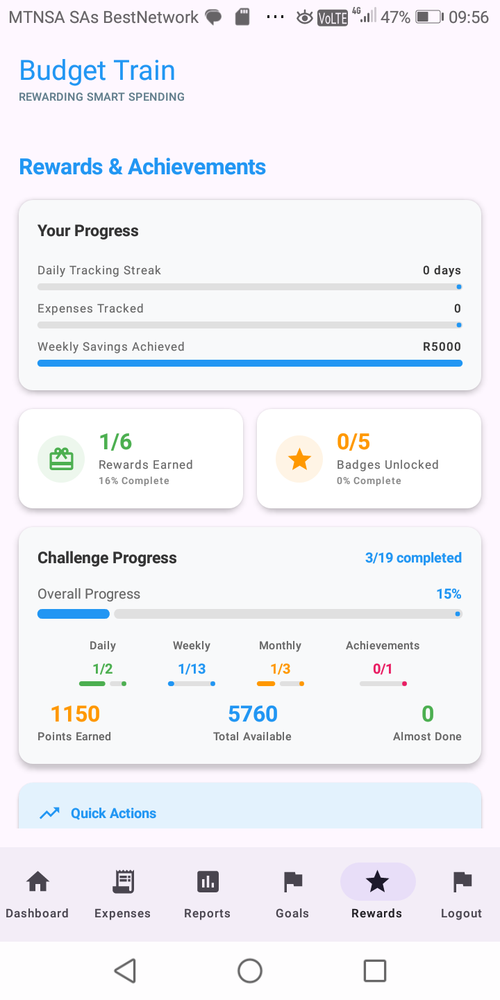
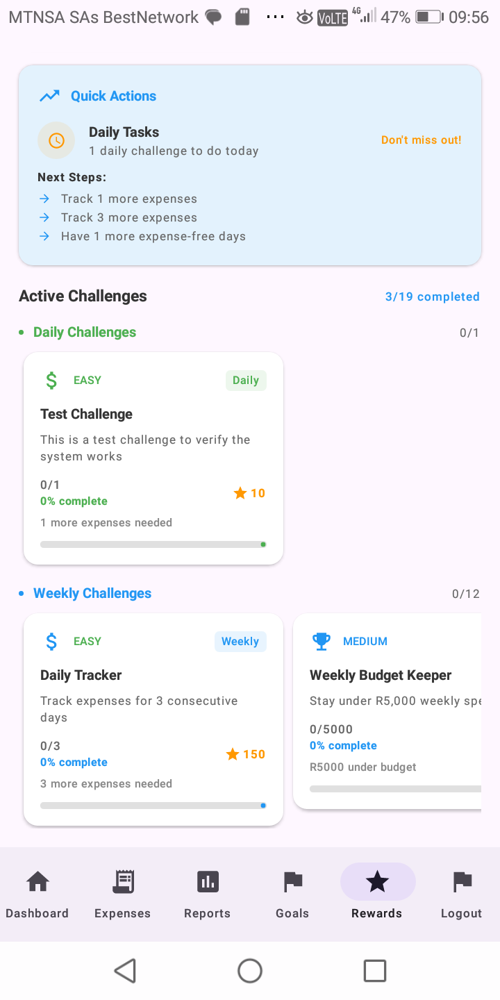
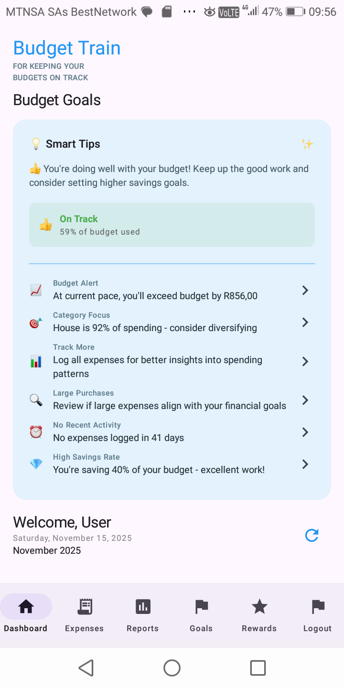

# 🚆 Budget Train
**For Keeping Your Budgets on Track**

## 📖 Overview
**Budget Train** is a mobile budgeting app built in **Android Studio** that transforms personal finance into an engaging experience.  
It combines **expense tracking**, **goal setting**, and **gamification** to help users manage money with clarity and motivation.

The app aims to provide a **simple, visual, and interactive** experience while giving users tools to take control of their spending, meet their savings goals, and build good financial habits.

---

## ✨ Key Features
- **User Authentication** – Register, log in, and recover your account securely.  
- **Expense Management** – Add, edit, delete expenses and attach receipts.  
- **Category System** – Customizable spending categories with colors/icons.  
- **Budgets & Alerts** – Set monthly limits and get smart notifications.  
- **Visual Reports** – Charts and progress rings to show spending patterns.  
- **Gamification** – Earn badges and achievements for consistent budgeting.  
- **Offline Storage** – All data saved locally with FireBase.

---

## 🛠 Part 3 – Custom Features

### 1. 🏆 **App Rewards System**
**Overview:**  
The Rewards System gamifies budgeting to make financial management engaging. Users earn badges and achievements based on their behavior, encouraging good habits and consistency in tracking expenses and meeting budgets.

**Key Functionalities:**  
- **Milestone Tracking:** Monitors user activity, such as daily expense logging, staying within budget, or achieving savings goals.  
- **Badge System:** Visual badges appear on the Home Screen and Dashboard to celebrate achievements.  
  - **Consistency Badge:** Awarded for logging expenses daily for 7 consecutive days.  
  - **Budget Master Badge:** Earned for staying within all category budgets for a full month.  
  - **Saving Star Badge:** Triggered when the user reaches a savings goal set in the app.  
- **Progress Feedback:** Users can see their progress toward the next badge, motivating continued engagement.

**Purpose:**  
- Reinforces positive budgeting habits.  
- Encourages users to interact with the app regularly.  
- Adds a playful and motivating layer to financial management.

**How to Test:**  
1. Log expenses daily for a week → check if **Consistency Badge** appears.  
2. Stay under budget in all categories for the month → verify **Budget Master Badge** triggers.  
3. Reach or exceed a defined savings goal → confirm **Saving Star Badge** is awarded.  
4. Track progress indicators to ensure correct badge display and progress updates.  

---

### 2. 💡 **Smart Budget Tips on Home Screen**
**Overview:**  
Smart Tips provide personalized advice to users based on their current spending patterns and budget performance. This mini “financial coach” gives actionable suggestions directly on the Home Screen.

**Key Functionalities:**  
- **Real-Time Analysis:** Evaluates spending vs. budget for each category.  
- **Dynamic Tips:** Generates context-sensitive advice, such as:
  - “You’ve spent 80% of your dining budget halfway through the month. Consider cooking at home more.”  
  - “You’ve saved 20% more than last month — keep it up!”  
- **Multiple Tips Display:** Users can swipe through several tips.  
- **Integration with Budgets:** Updates automatically as transactions are added or removed.

**Purpose:**  
- Helps users make better financial decisions without needing to analyze data manually.  
- Encourages awareness of spending habits.  
- Adds an interactive, smart element to the app that makes it feel responsive and intelligent.

**How to Test:**  
1. Add expenses approaching category limits → verify relevant tip appears.  
2. Save more than the expected amount → confirm congratulatory tip shows.  
3. Remove or edit expenses → check if tips update dynamically.  
4. Swipe through tips to confirm multiple suggestions display correctly.

---

## 🖼️ Images / Screenshots

###  Rewards and Achievements :

### Reward System 2 :

### Smart Tips on Home Screen :

---
## 📦 APK
[Download APK](apk/BudgetTrain.apk)  

---
## 🖥️ Tech Stack
- **IDE:** Android Studio  
- **Language:** Kotlin / Java  
- **Database:** RoomDB (Local Encrypted)  
- **UI:** Material Design Components  
- **Min SDK:** Android 8.0 (API 26)  

---

## 📱 App Flow
1. **Welcome Screen:** Choose to Login or Register  
2. **Register/Login:** Secure account creation and access  
3. **Dashboard:** Budget overview and navigation bar  
4. **Add Expense:** Record transactions with receipts  
5. **Categories:** Create or edit expense categories  
6. **Reports:** View spending summaries and charts  
7. **Badges:** Track gamified achievements  
8. **Smart Tips:** Personalized suggestions appear on Home Screen  
9. **Logout:** End session securely  

---

## 🎥 Demo
🎬 [Watch Demo Video](https://youtu.be/HGRjWE0wojM)

---

## 👩🏽‍💻 Developers
- **Palesa Gaetsewe**  
- **Keegan Naidoo**  
- **Faraaz Suffla**  

**Module:** Open Source Coding – 2025  

---

## 📝 License
For educational use only. Redistribution or commercial use prohibited.

